# 🚀 AnyAPI Module v0.8.0

[](https://github.com/Overlord-Z/AnyAPI/releases)
[](https://github.com/Overlord-Z/AnyAPI/blob/main/LICENSE)
[](https://github.com/PowerShell/PowerShell)
[](https://github.com/Overlord-Z/AnyAPI)
[](https://github.com/Overlord-Z/AnyAPI)

> **A comprehensive PowerShell module for REST API integration with advanced authentication, intelligent pagination, cross-platform secret management, and fluent builder patterns.**

> **⚠️ Development Preview** - This project is currently in active development and not yet officially released. Features and APIs may change.

## 🌟 Overview

AnyAPI transforms PowerShell into a powerful REST API client with enterprise-grade features for authentication, secret management, and data processing. Whether you're automating API workflows, building integrations, or managing multi-platform deployments, AnyAPI provides the tools you need.

```mermaid
graph TD
    A[🎯 AnyAPI Module] --> B[🔐 Authentication Engine]
    A --> C[📊 Data Processing]
    A --> D[🔒 Secret Management]
    A --> E[🔧 Builder Patterns]
    
    B --> B1[API Keys]
    B --> B2[Bearer Tokens]
    B --> B3[Custom Scripts]
    B --> B4[OAuth2 Flows]
    
    C --> C1[Intelligent Pagination]
    C --> C2[Streaming Support]
    C --> C3[Batch Processing]
    C --> C4[Error Handling]
    
    D --> D1[SecretManagement]
    D --> D2[Cross-Platform Vaults]
    D --> D3[Encrypted Storage]
    D --> D4[Session Management]
    
    E --> E1[ApiRequestBuilder]
    E --> E2[ProfileInitializationBuilder]
    E --> E3[Fluent Interface]
    E --> E4[Pipeline Support]
    
    style A fill:#e1f5fe
    style B fill:#f3e5f5
    style C fill:#e8f5e8
    style D fill:#fce4ec
    style E fill:#fff3e0
```



## ✨ Key Features

### 🚀 **Universal API Integration**
- **Any REST API** - Universal compatibility with all REST endpoints
- **Smart Detection** - Automatic pagination and authentication discovery
- **Fluent Builders** - Chainable method syntax for readable code
- **High Performance** - Optimized for speed and memory efficiency

### 🔐 **Advanced Authentication**
- **Multiple Methods** - API Keys, Bearer Tokens, OAuth2, Custom Scripts
- **Dynamic Authentication** - Runtime credential resolution and refresh
- **Secure Storage** - Cross-platform encrypted credential management
- **Token Management** - Automatic refresh and rotation support

### 📄 **Intelligent Pagination**

```mermaid
flowchart LR
    A[API Response] --> B{Pagination Type?}
    B -->|Link Header| C[RFC 5988<br/>GitHub Style]
    B -->|Cursor Based| D[NextToken<br/>Graph Style]
    B -->|Page Based| E[Page/PageSize<br/>Traditional]
    B -->|Offset/Limit| F[Database Style<br/>Skip/Take]
    
    C --> G[🔄 Auto Continue]
    D --> G
    E --> G
    F --> G
    
    style A fill:#e3f2fd
    style G fill:#c8e6c9
```

### 🔒 **Enterprise Security**
- **SecretManagement Integration** - Microsoft.PowerShell.SecretManagement
- **Cross-Platform Vaults** - Windows DPAPI, macOS Keychain, Linux Secret Service
- **Persistent Sessions** - Secure credential caching between sessions
- **Zero-Trust Architecture** - No plain-text credential storage

### 🔧 **Builder Pattern Support** *(NEW in v0.8.0)*
- **ApiRequestBuilder** - Fluent interface for building API requests
- **ProfileInitializationBuilder** - Chainable profile configuration
- **Pipeline Support** - PowerShell pipeline-friendly fluent methods
- **Backward Compatibility** - All existing parameter-based syntax still works

## 🛠️ Installation

### Quick Install
```powershell
# Clone from GitHub and import
git clone https://github.com/Overlord-Z/AnyAPI.git
Import-Module .\AnyAPI\AnyAPI.psm1

# Or download and import directly
Import-Module .\path\to\AnyAPI.psm1
```

### Initial Setup
```powershell
# Import the module
Import-Module AnyAPI

# Initialize secure secret storage (one-time setup)
Initialize-SecretStore

# Verify installation
Get-Command -Module AnyAPI
Test-SecretStorage
```

## 🚀 Quick Start

### 1. **Command-Line Profile Setup**
```powershell
# GitHub API with automatic secret storage
Initialize-AnyApiProfile -ProfileName "GitHub" `
    -BaseUrl "https://api.github.com" `
    -AuthenticationDetails @{
        AuthType = "BearerToken"
        TokenValue = "ghp_your_token_here"  # Automatically encrypted & stored
    } `
    -PaginationDetails @{ Type = "LinkHeader" }

# Verify profile creation
Get-AnyApiProfile -ProfileName "GitHub"
```

### 2. **Fluent Builder Pattern** *(NEW Enhanced)*
```powershell
# Create complex requests with chainable methods
$repos = New-ApiRequestBuilder -ProfileName "GitHub" -Endpoint "/user/repos" |
    WithQueryParameters @{ sort = "updated"; per_page = 100 } |
    WithPagination $true 100 1000 |
    WithHeaders @{ "Accept" = "application/vnd.github.v3+json" } |
    WithRetryPolicy 5 2000

$repositories = Invoke-AnyApiEndpoint -RequestBuilder $repos

# Profile initialization with builder pattern
$profile = New-ProfileInitializationBuilder -ProfileName "ComplexAPI" `
    -BaseUrl "https://api.example.com" `
    -AuthenticationDetails @{ AuthType = "ApiKey"; ApiKeyName = "key"; ApiKeyValue = "secret" } |
    WithPagination @{ Type = "PageBased"; DefaultPageSize = 50 } |
    WithErrorHandling @{ MaxRetries = 5; ExponentialBackoff = $true } |
    WithDefaultHeaders @{ "User-Agent" = "AnyAPI/0.8.0" }

Initialize-AnyApiProfile -ProfileBuilder $profile
```

### 3. **Simple API Calls**
```powershell
# Simple GET request - secrets automatically retrieved
$repos = Invoke-AnyApiEndpoint -ProfileName "GitHub" -Endpoint "/user/repos"

# GET with query parameters
$issues = Invoke-AnyApiEndpoint -ProfileName "GitHub" `
    -Endpoint "/repos/owner/repo/issues" `
    -QueryParameters @{ state = "open"; per_page = 50 }

# POST request with body
$newIssue = Invoke-AnyApiEndpoint -ProfileName "GitHub" `
    -Endpoint "/repos/owner/repo/issues" `
    -Method "POST" `
    -Body @{
        title = "New issue"
        body = "Issue description"
        labels = @("bug", "enhancement")
    }
```

## 🖥️ Running the GUI

A graphical interface for AnyAPI is available as a separate component.  
To launch the GUI, simply run the provided start script from the GUI directory:

```powershell
# From the root of the repository or the GUI folder:
pwsh ./start.ps1
```

The GUI provides a visual way to manage profiles and explore APIs.  
A full guide to the GUI will be published separately.

## 🎯 Architecture Overview


## 🔐 Authentication Methods

### API Key Authentication
```powershell
# Header-based API key
Initialize-AnyApiProfile -ProfileName "HeaderAPI" `
    -BaseUrl "https://api.example.com" `
    -AuthenticationDetails @{
        AuthType = "ApiKey"
        ApiKeyLocation = "Header"
        ApiKeyName = "X-API-Key"
        ApiKeyValue = "your-secret-key"  # Stored securely
    }

# Query parameter API key
Initialize-AnyApiProfile -ProfileName "QueryAPI" `
    -BaseUrl "https://api.example.com" `
    -AuthenticationDetails @{
        AuthType = "ApiKey"
        ApiKeyLocation = "QueryParameter"
        ApiKeyName = "api_key"
        ApiKeyValue = "your-secret-key"  # Stored securely
    }
```

### Bearer Token (OAuth2/JWT)
```powershell
# Simple bearer token
Initialize-AnyApiProfile -ProfileName "BearerAPI" `
    -BaseUrl "https://api.example.com" `
    -AuthenticationDetails @{
        AuthType = "BearerToken"
        TokenValue = "eyJhbGciOiJIUzI1NiIs..."  # JWT token stored securely
    }
```

### Custom Authentication Scripts
```powershell
# Advanced OAuth2 with automatic token refresh
$oAuth2Script = {
    param($RequestContext, $Profile)
    
    # Access secrets with enhanced helper methods
    $clientId = $RequestContext.GetPlainTextSecret.Invoke('ClientId')
    $clientSecret = $RequestContext.GetPlainTextSecret.Invoke('ClientSecret')
    $refreshToken = $RequestContext.GetPlainTextSecret.Invoke('RefreshToken')
    
    # Check token expiration
    $tokenExpiry = $Profile.CustomSettings.TokenExpiry
    if (-not $tokenExpiry -or (Get-Date) -gt [DateTime]$tokenExpiry) {
        # Refresh token logic
        $tokenResponse = Invoke-RestMethod -Uri "$($Profile.BaseUrl)/oauth/token" `
            -Method POST -Body @{
                grant_type = "refresh_token"
                refresh_token = $refreshToken
                client_id = $clientId
                client_secret = $clientSecret
            }
        
        # Store new tokens securely
        $newTokenSecure = ConvertTo-SecureString $tokenResponse.access_token -AsPlainText -Force
        Set-Secret -Name "AnyAPI.$($RequestContext.ProfileName).TokenValue" -Secret $newTokenSecure
        
        $RequestContext.Headers["Authorization"] = "Bearer $($tokenResponse.access_token)"
    } else {
        $currentToken = $RequestContext.GetPlainTextSecret.Invoke('TokenValue')
        $RequestContext.Headers["Authorization"] = "Bearer $currentToken"
    }
}

Initialize-AnyApiProfile -ProfileName "OAuth2API" `
    -BaseUrl "https://api.oauth-example.com" `
    -AuthenticationDetails @{
        AuthType = "CustomScript"
        AuthScriptBlock = $oAuth2Script
        ClientId = "your-client-id"
        ClientSecret = "your-client-secret"
        RefreshToken = "your-refresh-token"
    }
```

## 📊 Pagination Patterns


### Supported Pagination Types

| Type | Example APIs | Detection Method | Parameters |
|------|-------------|------------------|------------|
| **Link Header** | GitHub, GitLab | `Link` header with `rel="next"` | Automatic |
| **Cursor Based** | Microsoft Graph, Twitter | `nextToken`, `@odata.nextLink` | `NextTokenField` |
| **Page Based** | Most REST APIs | `page`, `pageSize` parameters | `PageParameter`, `PageSizeParameter` |
| **Offset/Limit** | Database APIs | `offset`, `limit` parameters | `OffsetParameter`, `LimitParameter` |

## 🛡️ Security & Secret Management

### SecretStore Integration


### Secret Management Functions
```powershell
# Initialize secure storage (one-time setup)
Initialize-SecretStore

# Test storage capabilities
Test-SecretStorage

# Get storage information
Get-SecretStorageInfo

# Reset storage provider detection
Reset-SecretStorage

# Manual secret operations (usually automatic)
$secureValue = ConvertTo-SecureString "secret" -AsPlainText -Force
Set-Secret -Name "AnyAPI.MyProfile.ApiKey" -Secret $secureValue -Vault "AnyAPI-SecretStore"

# List all AnyAPI secrets
Get-SecretInfo -Vault "AnyAPI-SecretStore" | Where-Object Name -like "AnyAPI.*"

# Debug secret storage issues
Debug-AnyApiSecrets -ProfileName "MyProfile" -ShowValues
```

## 🔧 Builder Pattern Guide

### ApiRequestBuilder Class

The `ApiRequestBuilder` provides a fluent interface for constructing API requests:

```powershell
# Create a new builder
$builder = New-ApiRequestBuilder -ProfileName "MyAPI" -Endpoint "/data"

# Chain methods for configuration
$request = $builder |
    WithMethod "POST" |
    WithQueryParameters @{ filter = "active"; sort = "name" } |
    WithPathParameters @{ id = "123" } |
    WithBody @{ name = "New Item"; status = "active" } |
    WithHeaders @{ "Custom-Header" = "value" } |
    WithContentType "application/json" |
    WithRetryPolicy 5 2000 |
    WithPagination $true 50 10 |
    WithStream { param($item) Write-Output $item.name } |
    SuppressErrors $true

# Execute the request
$result = Invoke-AnyApiEndpoint -RequestBuilder $request
```

#### Available Builder Methods

| Method | Parameters | Description |
|--------|------------|-------------|
| `WithMethod` | `[string]$Method` | Set HTTP method (GET, POST, PUT, PATCH, DELETE) |
| `WithQueryParameters` | `[hashtable]$QueryParameters` | Add query string parameters |
| `WithPathParameters` | `[hashtable]$PathParameters` | Add path parameters for URL templating |
| `WithBody` | `[object]$Body` | Set request body (object, hashtable, or string) |
| `WithHeaders` | `[hashtable]$Headers` | Add custom headers |
| `WithContentType` | `[string]$ContentType` | Set Content-Type header |
| `WithRetryPolicy` | `[int]$MaxRetries, [int]$InitialBackoffMs` | Configure retry behavior |
| `WithPagination` | `[bool]$GetAllPages, [int]$PageSize, [int]$MaxPages` | Enable pagination |
| `WithStream` | `[scriptblock]$Stream` | Enable streaming with callback |
| `SuppressErrors` | `[bool]$SuppressErrors` | Control error handling |

### ProfileInitializationBuilder Class

```powershell
# Create a new profile builder
$builder = New-ProfileInitializationBuilder -ProfileName "ComplexAPI" `
    -BaseUrl "https://api.complex.com/v2" `
    -AuthenticationDetails @{
        AuthType = "BearerToken"
        TokenValue = "your-token"
    }

# Chain configuration methods
$profile = $builder |
    WithPagination @{
        Type = "Cursor"
        NextTokenField = "nextToken"
        ItemsField = "results"
    } |
    WithErrorHandling @{
        MaxRetries = 5
        InitialBackoffMs = 2000
        ExponentialBackoff = $true
    } |
    WithDefaultHeaders @{
        "Accept" = "application/json"
        "User-Agent" = "MyApp/1.0"
    } |
    WithCustomSettings @{
        RateLimit = 1000
        Timeout = 30
    } |
    SessionOnly $false |
    ForceOverwrite $true

# Initialize the profile
Initialize-AnyApiProfile -ProfileBuilder $profile
```

## 🚀 Advanced Examples

### GitHub API Integration
```powershell
# Traditional approach - secrets now persist automatically
Initialize-AnyApiProfile -ProfileName "GitHub" `
    -BaseUrl "https://api.github.com" `
    -AuthenticationDetails @{
        AuthType = "BearerToken"
        TokenValue = "ghp_your_token"  # Stored in SecretStore
    } `
    -PaginationDetails @{ Type = "LinkHeader" }

# Get all repositories with builder pattern
$allRepos = New-ApiRequestBuilder -ProfileName "GitHub" -Endpoint "/user/repos" |
    WithPagination $true 100 1000 |
    WithQueryParameters @{ sort = "updated"; direction = "desc" }

$repositories = Invoke-AnyApiEndpoint -RequestBuilder $allRepos

# Search repositories with complex filtering
$searchRequest = New-ApiRequestBuilder -ProfileName "GitHub" -Endpoint "/search/repositories" |
    WithQueryParameters @{ 
        q = "language:powershell stars:>50"; 
        sort = "stars"; 
        order = "desc" 
    } |
    WithPagination $true 50 3 |
    WithRetryPolicy 5 2000

$topPowerShellRepos = Invoke-AnyApiEndpoint -RequestBuilder $searchRequest
```

### Microsoft Graph API
```powershell
# Graph API with builder pattern
$graph = New-ProfileInitializationBuilder -ProfileName "Graph" `
    -BaseUrl "https://graph.microsoft.com/v1.0" `
    -AuthenticationDetails @{
        AuthType = "BearerToken"
        TokenValue = "your-access-token"
    } |
    WithPagination @{
        Type = "Cursor"
        NextTokenField = "@odata.nextLink"
        ItemsField = "value"
    } |
    WithDefaultHeaders @{
        "ConsistencyLevel" = "eventual"
    }

Initialize-AnyApiProfile -ProfileBuilder $graph

# Get all users with streaming
$userRequest = New-ApiRequestBuilder -ProfileName "Graph" -Endpoint "/users" |
    WithQueryParameters @{ '$select' = 'displayName,mail,userPrincipalName' } |
    WithPagination $true 999 10 |
    WithStream {
        param($user)
        Write-Host "User: $($user.displayName) - $($user.mail)"
    }

Invoke-AnyApiEndpoint -RequestBuilder $userRequest
```

### ConnectWise Manage API
```powershell
# ConnectWise authentication script
$connectWiseScript = {
    param($RequestContext, $Profile)
    
    Write-Verbose "ConnectWise authentication executing for profile '$($RequestContext.ProfileName)'"
    
    # Get ConnectWise credentials
    $company = $Profile.CustomSettings.Company ?? "your-company-id"
    $publicKey = $RequestContext.GetPlainTextSecret.Invoke('PublicKey')
    $privateKey = $RequestContext.GetPlainTextSecret.Invoke('PrivateKey')
    $clientId = $RequestContext.GetPlainTextSecret.Invoke('ClientId')
    
    if (-not $company -or -not $publicKey -or -not $privateKey -or -not $clientId) {
        throw "Missing required ConnectWise credentials"
    }
    
    # Create ConnectWise authentication
    $authString = "$company+$publicKey`:$privateKey"
    $encodedAuth = [Convert]::ToBase64String([System.Text.Encoding]::UTF8.GetBytes($authString))
    
    # Set ConnectWise headers
    $RequestContext.Headers["Authorization"] = "Basic $encodedAuth"
    $RequestContext.Headers["clientId"] = $clientId
    $RequestContext.Headers["Accept"] = "application/json"
    $RequestContext.Headers["Content-Type"] = "application/json"
}

# Initialize ConnectWise profile
Initialize-AnyApiProfile -ProfileName "ConnectWise" `
    -BaseUrl "https://your-cw-server.com/v4_6_release/apis/3.0" `
    -AuthenticationDetails @{
        AuthType = "CustomScript"
        AuthScriptBlock = $connectWiseScript
        PublicKey = "your-public-key"
        PrivateKey = "your-private-key"  
        ClientId = "your-client-uuid"
    } `
    -CustomSettings @{
        Company = "your-company-identifier"
    } `
    -Force

# Get companies with pagination
$companies = Invoke-AnyApiEndpoint -ProfileName "ConnectWise" -Endpoint "/company/companies" -GetAllPages

# Create a new ticket
$newTicket = New-ApiRequestBuilder -ProfileName "ConnectWise" -Endpoint "/service/tickets" |
    WithMethod "POST" |
    WithBody @{
        summary = "API Test Ticket"
        company = @{ id = 123 }
        board = @{ id = 45 }
        status = @{ id = 1 }
        priority = @{ id = 3 }
    } |
    WithRetryPolicy 3 1000

$createdTicket = Invoke-AnyApiEndpoint -RequestBuilder $newTicket
```

### Batch Data Processing
```powershell
# Process large datasets with streaming
$dataRequest = New-ApiRequestBuilder -ProfileName "DataAPI" -Endpoint "/analytics/events" |
    WithQueryParameters @{ 
        startDate = (Get-Date).AddDays(-30).ToString("yyyy-MM-dd")
        endDate = (Get-Date).ToString("yyyy-MM-dd")
        format = "detailed"
    } |
    WithPagination $true 1000 100 |
    WithStream {
        param($event)
        # Process each event individually to avoid memory issues
        if ($event.severity -eq "critical") {
            Send-Alert -Event $event
        }
        Export-EventToDatabase -Event $event
    } |
    WithRetryPolicy 10 5000

# Execute with progress tracking
$results = Invoke-AnyApiEndpoint -RequestBuilder $dataRequest
```

## 📊 Performance & Monitoring

### Built-in Performance Features
- **Connection Pooling** - Reuse HTTP connections for efficiency
- **Authentication Header Caching** - Reduces overhead for repeated calls
- **Pagination Type Caching** - Cached after first detection
- **Memory Streaming** - Process large datasets without memory bloat
- **Retry Logic** - Exponential backoff with jitter for reliability

### Performance Management
```powershell
# Clear caches for troubleshooting
Clear-AuthHeaderCache -ProfileName "MyAPI"
Clear-PaginationTypeCache -ProfileName "MyAPI"
Clear-AllProfileCaches -ProfileName "MyAPI"

# Debug performance issues
$VerbosePreference = "Continue"
Invoke-AnyApiEndpoint -ProfileName "MyAPI" -Endpoint "/data" -Verbose

# Check last response headers
$script:LastResponseHeaders
```

## 🔧 Profile Management

### View Profiles
```powershell
# List all profiles
Get-AnyApiProfile

# Get specific profile
Get-AnyApiProfile -ProfileName "GitHub"

# Get multiple profiles
Get-AnyApiProfile -ProfileName @("GitHub", "MyAPI")
```

### Export/Import Profiles
```powershell
# Export profiles (secrets scrubbed by default)
Export-AnyApiConfiguration -Path ".\api-profiles.json"

# Export with secrets (USE WITH CAUTION)
Export-AnyApiConfiguration -Path ".\api-profiles-with-secrets.json" -IncludeSecrets

# Import profiles
Import-AnyApiConfiguration -Path ".\api-profiles.json" -MergeStrategy "Overwrite"
```

### Remove Profiles
```powershell
# Remove a profile (with confirmation)
Remove-AnyApiProfile -ProfileName "OldAPI"

# Force removal without confirmation
Remove-AnyApiProfile -ProfileName "OldAPI" -Confirm:$false
```

## 🐛 Troubleshooting

### Diagnostic Commands
```powershell
# Check module status
Get-Module AnyAPI
Get-Command -Module AnyAPI

# Test secret storage
Test-SecretStorage
Get-SecretStorageInfo
Reset-SecretStorage

# Debug profile issues
Get-AnyApiProfile -ProfileName "YourAPI"
Debug-AnyApiSecrets -ProfileName "YourAPI"

# Test connectivity with verbose output
Invoke-AnyApiEndpoint -ProfileName "YourAPI" -Endpoint "/health" -Verbose
```

### Common Issues & Solutions

| Issue | Cause | Solution |
|-------|-------|----------|
| **Secrets not persisting** | SecretStore not initialized | Run `Initialize-SecretStore` |
| **Authentication failures** | Invalid credentials or format | Check with `Debug-AnyApiSecrets` |
| **Pagination not working** | Auto-detection failed | Configure manually in profile |
| **Performance issues** | No caching/streaming | Enable streaming for large datasets |
| **Builder errors** | Invalid parameters | Check builder validation with `IsValid()` |

### Debug Mode
```powershell
# Enable comprehensive debugging
$VerbosePreference = "Continue"
$DebugPreference = "Continue"

# Test with full verbosity
Invoke-AnyApiEndpoint -ProfileName "TestAPI" -Endpoint "/debug" -Verbose -Debug

# Check cached values
$script:AuthHeaderCache
$script:PaginationTypeCache
```

## 🤝 Contributing

We welcome contributions! Please see our [Contributing Guide](https://github.com/Overlord-Z/AnyAPI/blob/main/CONTRIBUTING.md) for details.

### Development Setup
```bash
# Clone the repository
git clone https://github.com/Overlord-Z/AnyAPI.git
cd AnyAPI

# Install development dependencies
pwsh -c "Install-Module Pester, PSScriptAnalyzer -Scope CurrentUser"

# Run tests
pwsh -c "Invoke-Pester"

# Check code quality
pwsh -c "Invoke-ScriptAnalyzer -Path . -Recurse"
```

## 📈 Roadmap to v1.0

```mermaid
timeline
    title AnyAPI Development Roadmap
    
    section v0.8.0 (Current)
        : Enhanced Builder Patterns
        : Advanced Secret Management
        : Performance Optimizations
        : Cross-Platform Support
    
    section v0.9.0 (Planned)
        : GraphQL Support
        : Plugin Architecture
        : Advanced Monitoring
        : Cloud Integration
    
    section v1.0.0 (Target)
        : Production Ready
        : Comprehensive Testing
        : Full Documentation
        : PowerShell Gallery
```

## 📄 Version History

### v0.8.0 (Current) - *"Enhanced Builder Patterns & Performance"*
- ✅ **NEW**: Enhanced `ApiRequestBuilder` with fluent interface and pipeline support
- ✅ **NEW**: `ProfileInitializationBuilder` for complex profile configuration
- ✅ **NEW**: Pipeline-friendly builder methods (`WithMethod`, `WithHeaders`, etc.)
- ✅ **NEW**: Advanced authentication caching with custom script support
- ✅ **NEW**: `Debug-AnyApiSecrets` function for troubleshooting credential issues
- ✅ **ENHANCED**: Cross-platform secret management with SecretStore integration
- ✅ **ENHANCED**: Performance optimizations with intelligent caching
- ✅ **ENHANCED**: Custom authentication scripts with enhanced secret access
- ✅ **ENHANCED**: Comprehensive pagination support with auto-detection

### v0.3.0 - *"Secret Storage & Custom Auth"*
- ✅ Enhanced secret storage with SecretManagement integration
- ✅ Custom authentication script support
- ✅ Fluent builder pattern introduction
- ✅ Performance optimizations

### v0.2.0 - *"Pagination & Profiles"*
- ✅ Intelligent pagination support
- ✅ Profile persistence
- ✅ Enhanced authentication handling

### v0.1.0 - *"Foundation"*
- ✅ Initial REST API support
- ✅ Basic authentication methods
- ✅ Core functionality

## 🙏 Acknowledgments

- **James Zaenglein** - Creator and primary maintainer of AnyAPI
- Microsoft PowerShell Team for the excellent SecretManagement module
- The PowerShell Community for invaluable feedback and contributions
- All API providers who maintain excellent documentation and standards

---

<div align="center">

**[🏠 Home](https://github.com/Overlord-Z/AnyAPI)** • 
**[📚 Documentation](https://github.com/Overlord-Z/AnyAPI/wiki)** • 
**[💬 Discussions](https://github.com/Overlord-Z/AnyAPI/discussions)** • 
**[🐛 Issues](https://github.com/Overlord-Z/AnyAPI/issues)**

Created with ❤️ by James Zaenglein for the PowerShell community

</div>